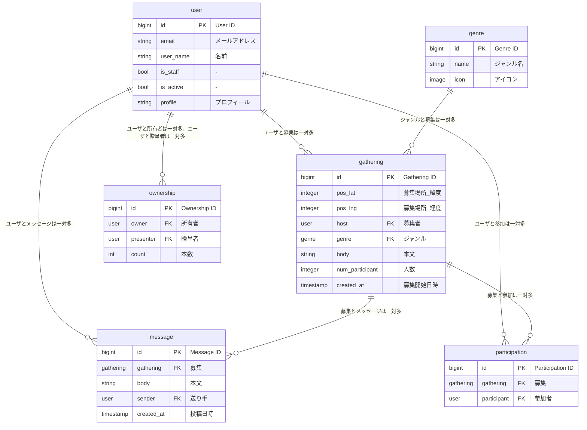

# yuruboo
GPSをもとにしてすぐに遊びにゆく友達を探すゆるぼアプリ

# ER図


# エンドポイントの定義
```
- user
POST /users
GET, PUT, PATCH, DELETE /users/{user_id}

- genre
GET /genres
GET /genres/{genre_id}

(ジャンルは、変更・追加・削除不可)


- gathering
POST /gatherings
GET /gatherings
GET, PUT, PATCH, DELETE /gatherings/{gathering_id}

- participation
POST /participations
GET /participations (& gathering={gathering_id}) (& participant={user_id})
GET, DELETE /participations/{participation_id}

(参加は、変更不可)

- message
POST /messages
GET /messages (& gathering={gathering_id})
GET /messages/{message_id} 

(個別メッセージは変更・削除不可)

- ownerships
POST /ownerships
GET /ownerships (& owner={user_id})
GET, PUT, PATCH /ownerships/{ownership_id}

(ownershipの削除不可)
```


# 環境構築
プロジェクトをcloneする
```
git clone https://github.com/team-yurubo/yuruboo.git
```
reactの環境構築
```
cd yuruboo
cd frontend
npm install
npm run dev
```
LocalHostに接続して、react + viteの画面が表示されたら成功

djangoの環境構築 & 仮想環境の構築
```
cd ../backend
source venv/bin/activate
```
仮想環境に入ったら(venv)が表示される
```
pip install -r requirements.txt
cd backend
python manage.py runserver
```
LocalHostに接続して、djangoの画面が表示されたら成功

# テストアプリの実行
```
cd sandbox/map_test
npm install
npm run dev
```

# プロジェクトの実行
### バックエンドの起動

ターミナルを立ち上げ、`yuruboo/backend/backend`に移動(manage.pyのあるディレクトリ)し、以下を実行
```
python manage.py runserver
```
もしなんかエラーが起きたら以下を実行
```
pip install -r requirements.txt
```

ターミナルを立ち上げ、`yuruboo/backend/backend`に移動(manage.pyのあるディレクトリ)し、以下を実行することで、
DBの初期化、初期データの挿入、サーバの立ち上げまでやってくれる(MacのZshの場合のみ使用可能)
```
zsh -x dbstart.sh
```

### フロントエンドの起動

バックエンドとは別の**新しいターミナル**を立ち上げ、`yuruboo/frontend`に移動(index.html)し、以下を実行
```
npm run dev
```
もしなんかエラーが起きたら以下を実行
```
npm install
```
これでもなんかエラーが起きたら以下を実行
```
(macの場合)
rm -rf node_modules
npm install

(windoewの場合)
rm -r node_modules
npm install
```
最後に、`http://127.0.0.1:5173/`or`http://localhost:5173/`にアクセス
