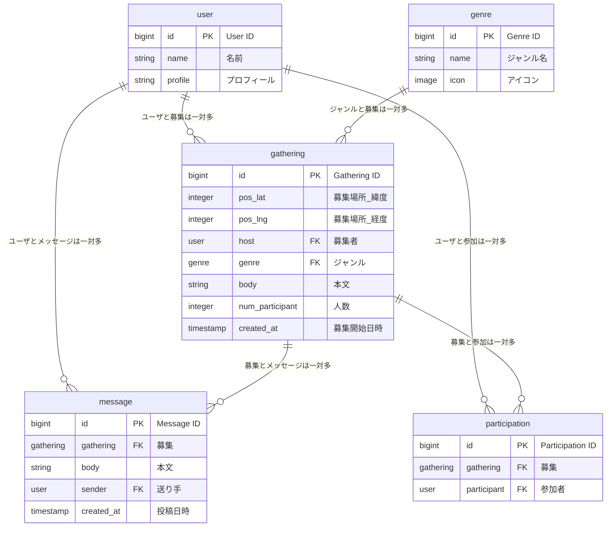

# yuruboo
GPSをもとにしてすぐに遊びにゆく友達を探すゆるぼアプリ

# ER図


# 環境構築
プロジェクトをcloneする
```
git clone https://github.com/team-yurubo/yuruboo.git
```
reactの環境構築
```
cd yuruboo
cd frontend
npm install
npm run dev
```
LocalHostに接続して、react + viteの画面が表示されたら成功

djangoの環境構築 & 仮想環境の構築
```
cd ../backend
source venv/bin/activate
```
仮想環境に入ったら(venv)が表示される
```
pip install requirements.txt
cd backend
python manage.py runserver
```
LocalHostに接続して、djangoの画面が表示されたら成功

# テストアプリの実行
```
cd sandbox/map_test
npm install
npm run dev
```
test